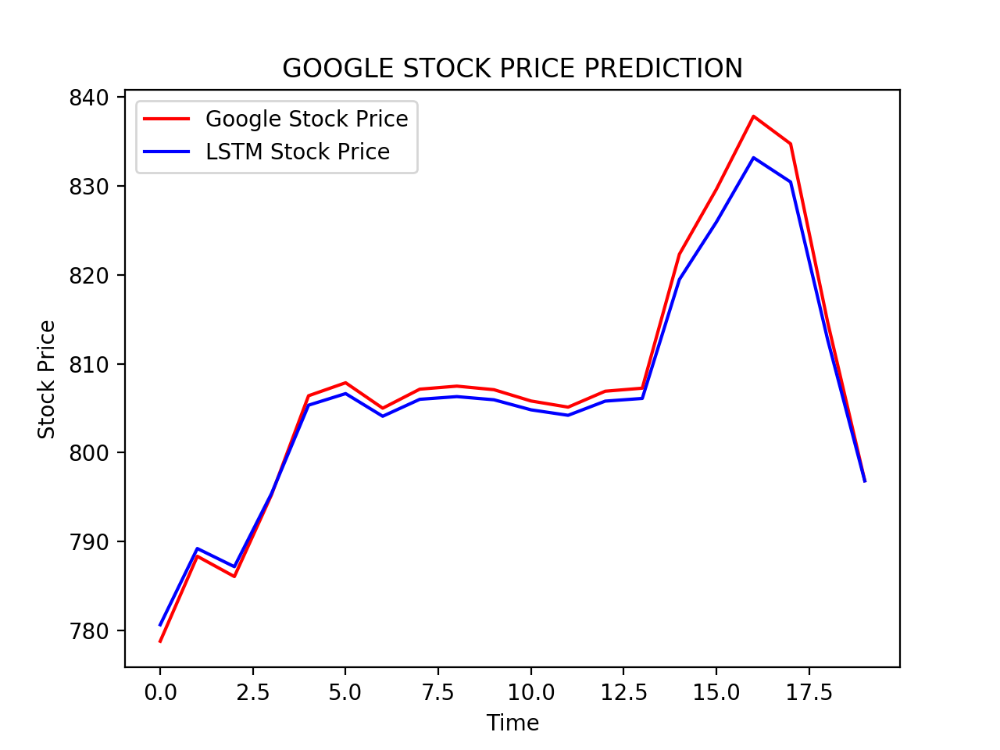

## Google stock prices using LSTM

This codebase predict stock prices using Long-Short term mermory (LSTM)  and also plot the result in a chart.

### Parameter

- optimizer= `rmsprop`.
- loss = `mean_squared_error`.
- epochs = 400.
- batch_size = 32.

Feel free to fineå tune parameters.

### Result.

 
 
